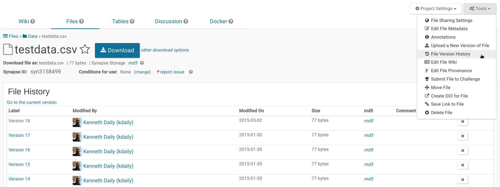

```{r setup, include=FALSE}
knitr::opts_chunk$set(echo = FALSE)
```

## 

> Non-profit biomedical research institute founded in 2007, based in Seattle, WA

<br/>

> We work to redefine how complex biological data is gathered, shared, and used through open systems, incentives, and processes.

## Our focus

> Engage <span style="color: #177bad">**diverse communities**</span> of researchers around analytical problems too complex for a single institution

<br/>

> Empower <span style="color: #177bad">**citizens**</span> to track their own health and <span style="color: #177bad">**contribute**</span> deep phenotypic data to research topics important to them

## 

> A platform for supporting scientific collaborations centered around shared biomedical data sets with a goal of making biomedical research more transparent, more reproducible, and more accessible to a broader audience of scientists.


## https://www.synapse.org/


## Register

- email me (kenneth.daily@sagebase.org), or
- register at https://www.synapse.org/register and join the [Rally Team](https://www.synapse.org/#!Team:3367513)
- Become a [Certified User](https://www.synapse.org/#!Quiz:Certification) to create content

<span style="font-size: small">[Help with users](http://docs.synapse.org/articles/accounts_certified_users_and_profile_validation.html)</span>

## Projects

> A collaborative and sharable workspace for organization and description of data and analysis.


<br>
<span style="font-size: small">[Help on project organization](http://docs.synapse.org/articles/making_a_project.html)</span>

## Collaborative editing

Use text-based formatting (markdown) to author content 

<br>
<span style="font-size: small">[Help on Wikis](http://docs.synapse.org/articles/wikis.html)</span>


## Files and Folders

> Cloud storage for organizing files

Every file gets a unique identifier, e.g. [syn11689055](https://www.synapse.org/#!Synapse:syn11689055/) and DOI: https://doi.org/10.7303/syn11689055


<br/>
<span style="font-size: small">[Get help with files and folders](http://docs.synapse.org/articles/getting_started.html#organizing-data-creating-files-and-folders)</span>

## Versioning

> Data changes over time - update files without removing or overwriting them (e.g. [syn3158499.18](https://www.synapse.org/#!Synapse:syn3158499.18))


<br/>
<span style="font-size: small"> [Help with versioning](http://docs.synapse.org/articles/files_and_versioning.html#versioning)</span>

## Annotations and Views

<br/>

User-defined annotations enables you to search for data files across folders and projects


`SELECT * FROM syn11346063 WHERE assay='exomeSeq'`
`AND tissue='frontal pole'`

<span style="font-size: small">Help on [Annotation and query](http://docs.synapse.org/articles/annotation_and_query.html)</span>

## Provenance

> The place or source of origin.

What data and/or code was used to create something?


<br/>
<span style="font-size: small">[Help with provenance](http://docs.synapse.org/articles/provenance.html
)</span>

## Structured data

> Tabular data files (spreadsheets)

Example: [PCBC Cell Line Metadata (syn2767694)](https://www.synapse.org/#!Synapse:syn2767694/tables/)

Help on [tables](http://docs.synapse.org/articles/tables.html)

## Collaborative editing

> Use text-based formatting (markdown) to author content describing projects, folders, and files. Can use automated solutions (like RMarkdown) as well!

Example: [syn2233188](https://www.synapse.org/#!Synapse:syn2233188)

## Discussions

A Threaded forum with integration to data files - durable discussions related to the project, with email notifications.

Have questions? Ask in the [sprint discussion forum]()

[Help on discussion forums](http://docs.synapse.org/articles/discussion.html)

## Example code

```{r example, cache=TRUE, warning=FALSE, message=FALSE, echo=TRUE}
library(synapser)
library(tidyverse)

syn <- synLogin()

d <- synTableQuery("SELECT id, name,rally,sprintNumber,sprintTitle,sprintStart,sprintEnd FROM syn11689072")$asDataFrame()

d %>% select(-ROW_ID, -ROW_VERSION) %>% 
  mutate(sprintStart=lubridate::as_datetime(sprintStart / 1000),
         sprintEnd=lubridate::as_datetime(sprintEnd / 1000)) %>% knitr::kable()
```

## Rally 6, Sprint 6A

https://www.synapse.org/hbgdki_sprint_6A (syn11689055)