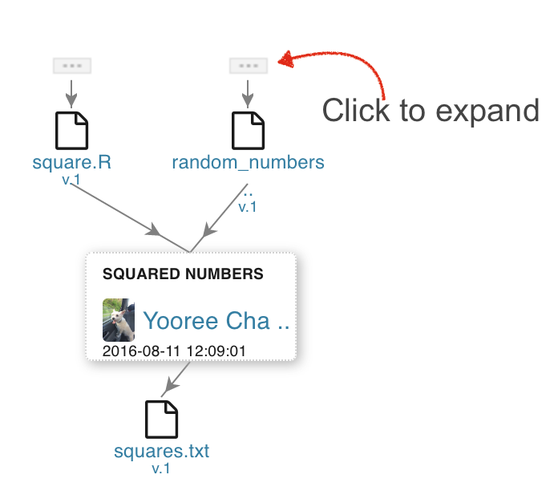
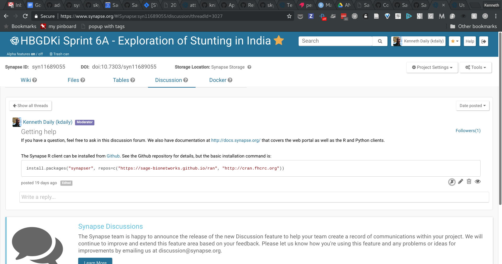

```{r setup, include=FALSE}
knitr::opts_chunk$set(echo = TRUE, message=FALSE, warning=FALSE)
```

# <br/>We work to redefine how complex biological data is gathered, shared, and used through open systems, incentives, and processes.

# [Synapse](https://www.synapse.org) is a platform for supporting collaborative research.

## 

A platform for supporting collaborations centered around shared data sets with a goal of making research more transparent, reproducible, and accessible to a broader audience.

## Getting started

- email me (kenneth.daily@sagebase.org)
- gets you on the [Rally Team](https://www.synapse.org/#!Team:3367513)

Then:

- become a [Certified User](https://www.synapse.org/#!Quiz:Certification) to create content
<br/>

Go to https://www.synapse.org/hbgdki_sprint_6A (syn11689055)

<span style="font-size: small">[Help with users](http://docs.synapse.org/articles/accounts_certified_users_and_profile_validation.html)</span>

## How you can use Synapse


## https://www.synapse.org/


## Synapse R client, [synapser](https://github.com/Sage-Bionetworks/synapser)

> Under development!

```{r eval=FALSE}
install.packages("synapser", 
                 repos=c("https://sage-bionetworks.github.io/staging-ran",
                         "http://cran.fhcrc.org"))
```

[Getting help with the Synapse R client](http://sage-bionetworks.github.io/synapser/)

(also a Python + command line client via `pip install synapseclient`)

# Projects: collaborative and sharable workspaces for organization and description of data and analysis.

## Projects


<br>
<span style="font-size: small">[Help on project organization](http://docs.synapse.org/articles/making_a_project.html)</span>

# Wikis: collaborative editing with text-based formatting (markdown) to author content.

## Wikis


<br>
<span style="font-size: small">[Help on Wikis](http://docs.synapse.org/articles/wikis.html)</span>

Wikis can be created for Projects, Files, and Folders, often to act as `README`-type documentation.

## Automated content creation

Use RMarkdown to generate content that can be pushed to Synapse Wiki pages.

See [Ramen Example](https://github.com/kdaily/20180212-hbgdki-rally-6-kickoff/blob/master/ramen.Rmd).

See the [Ramen example output on Synapse](https://www.synapse.org/#!Synapse:syn11801878).

# Files and Folders: cloud storage for organizing files.

## Files and Folders

Everything gets a unique identifier, e.g. [syn11689055](https://www.synapse.org/#!Synapse:syn11689055/) and DOI: https://doi.org/10.7303/syn11689055 (most current version)


<br/>
<span style="font-size: small">[Get help with files and folders](http://docs.synapse.org/articles/getting_started.html#organizing-data-creating-files-and-folders)</span>

# Versioning: update files without removing or overwriting them.

## Versioning

Version 18 of `testdata.csv`, stored at [syn3158499.18](https://www.synapse.org/#!Synapse:syn3158499.18)


<br/>
<span style="font-size: small"> [Help with versioning](http://docs.synapse.org/articles/files_and_versioning.html#versioning)</span>

# Provenance: what data and/or code was used to create something?

## Provenance


<br/>
<span style="font-size: small">[Help with provenance](http://docs.synapse.org/articles/provenance.html)</span>

# Discussion forums for communication about project data

## Discussion forums

A Threaded forum with integration to data files - durable discussions related to the project, with email notifications.

We'll use this for sprint check-ins - make sure you follow!

https://www.synapse.org/#!Synapse:syn11689055/discussion/



<span style="font-size: small">[Help on discussion forums](http://docs.synapse.org/articles/discussion.html)</span>

# Annotations: User-defined values enables search for files across folders and projects

## Annotations

Not good: `filename: sample1-replication1-2018_02_12-v2.csv`

Better: `filename: my-filename-doesnt-matter-20180212.csv`<br/>with attributes<br/>`{'sample': 1, replication: 1, date: '2018-02-12'}`<br/>versioning managed by Synapse

## Annotations

Things in Synapse can be annotated and then exposed for search and discovery.


<span style="font-size: small">Help on [Annotation and query](http://docs.synapse.org/articles/annotation_and_query.html) and [file views](http://docs.synapse.org/articles/view.html)</span>

# Getting Help

## Need help?

http://docs.synapse.org/

- [Getting Started](http://docs.synapse.org/articles/getting_started.html)
- [Feature articles](http://docs.synapse.org/articles/)
- [R client documentation](sage-bionetworks.github.io/synapser/)
- [Rally Discussion Forum](https://www.synapse.org/#!Synapse:syn11689055/discussion/)

## Presentation

# This presentation is available at [syn11801622](https://www.synapse.org/#!Synapse:syn11801622).

# Code examples

## Create a project

```{r createproject, eval=FALSE}
library(synapser)
syn <- synLogin(silent=TRUE)

myProject <- Project(name="My new fancy project with a unique name")
myProject <- synStore(myProject)
```

## File and Folder example
```{r eval=FALSE}
library(synapser)
syn <- synLogin(silent=TRUE)

d <- data.frame(a=rnorm(100))
write.csv(d, file = "/tmp/foo.csv")

folder <- synStore(Folder('my folder', parent="syn11801621"))
f <- synStore(File("/tmp/foo.csv", parent=folder))
```

## Download example

Downloading caches locally so subsequent `synGet`s are local *unless* file has changed.

```{r eval=FALSE}
library(synapser)
syn <- synLogin(silent=TRUE)

myFile <- synGet('syn11689055')
d <- readr::read_csv(myFile$path)
```

## Versioning Example

```{r eval=FALSE}
library(synapser)
syn <- synLogin(silent=TRUE)

d <- data.frame(a=rnorm(100))
write.csv(d, file = "/tmp/foo.csv")

# New data, same file location - md5 will have changed, so make a new version
d <- data.frame(a=rnorm(100))
write.csv(d, file = "/tmp/foo.csv")

# Version 2
folder <- synStore(Folder('my folder', parent="syn11801621"))
f <- synStore(File("/tmp/foo.csv", parent=folder))

```

## Example of annotating

```{r annotate, eval=FALSE}
library(synapser)
library(tidyverse)
syn <- synLogin(silent=TRUE)

# Set annotations and store a file
myFile <- File(path="testdata.csv", parent=folder,
               annotations=list(foo=34, fileFormat="csv"))
myFile <- synStore(myFile)

# Update annotations
myFile$annotations$foo <- 36
myFile <- synStore(myFile)
```

## Example query using a file view

```{r include=TRUE, echo=TRUE, eval=TRUE, warning=FALSE, message=FALSE}
library(synapser)
library(tidyverse)
syn <- synLogin(silent=TRUE)

q <- "SELECT id,name,study,tissue,assay FROM syn11346063 WHERE assay='exomeSeq' AND tissue='frontal pole'"

# Query the file view
synTableQuery(q)$asDataFrame() %>% 
  select(-ROW_ID, -ROW_VERSION, -ROW_ETAG) %>% slice(1:2) %>% knitr::kable()
```

<span style="font-size: small">Help on [Annotation and query](http://docs.synapse.org/articles/annotation_and_query.html) and [File Views](http://docs.synapse.org/articles/views.html)</span>

## Provenance example

```{r provenance, eval=FALSE}
dataUrl <- "https://gist.githubusercontent.com/kdaily/data.csv"
codeUrl <- "https://gist.githubusercontent.com/kdaily/code.R"

# Run code at codeUrl to generate data-summary.csv

summaryFile <- File("/tmp/ramen-summary.csv", parent=folder)
summaryFile <- synStore(summaryFile, used=ramenUrl, executed=codeUrl)
```

## View query example

This queries a Project View - the projects have been annotated to aid in discovery.

```{r example, cache=FALSE, warning=FALSE, message=FALSE, echo=TRUE}
library(synapser)
library(tidyverse)

syn <- synLogin(silent=TRUE)

d <- synTableQuery("SELECT id, name,rally,sprintNumber,sprintTitle,sprintStart,sprintEnd FROM syn11689072")$asDataFrame()

d %>% select(-ROW_ID, -ROW_VERSION, -ROW_ETAG) %>% 
  mutate(sprintStart=lubridate::as_datetime(sprintStart / 1000),
         sprintEnd=lubridate::as_datetime(sprintEnd / 1000)) %>% knitr::kable()
```

## Example using `githubr`

Use [`githubr`](https://www.github.com/Sage-Bionetworks/githubr) to get most recent commit of a file, render, and link with provenance.

```{r include=TRUE, echo=TRUE, eval=FALSE}
library(synapser)
library(githubr)
# setGithubToken('mytoken')

# Get remote github repository for this file
repo <- getRepo("kdaily/20180212-hbgdki-rally-6-kickoff")

# Get current path to version at latest commit
rmd <- getPermlink(repo, "presentation.Rmd")

# Render as HTML
x <- rmarkdown::render("./presentation.Rmd")

# Store in Synapse with provenance to Github file
f <- synStore(File(x, parentId="syn11801621"), used=rmd)
```
